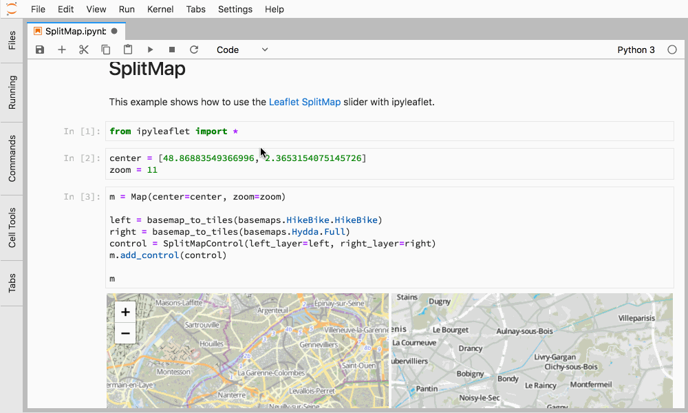
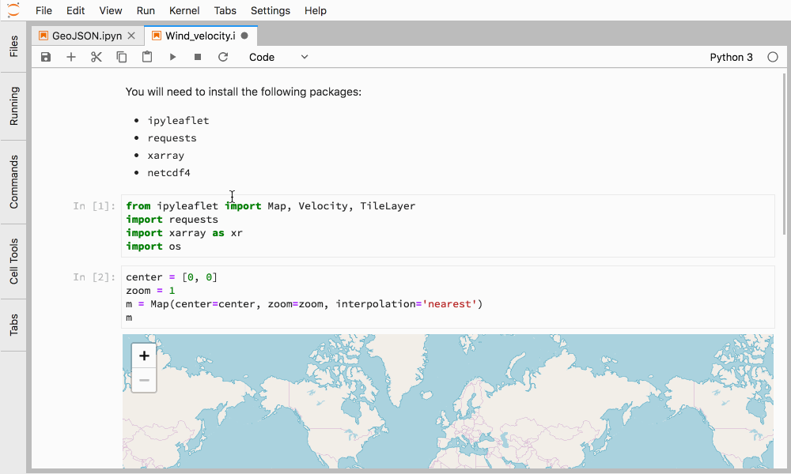
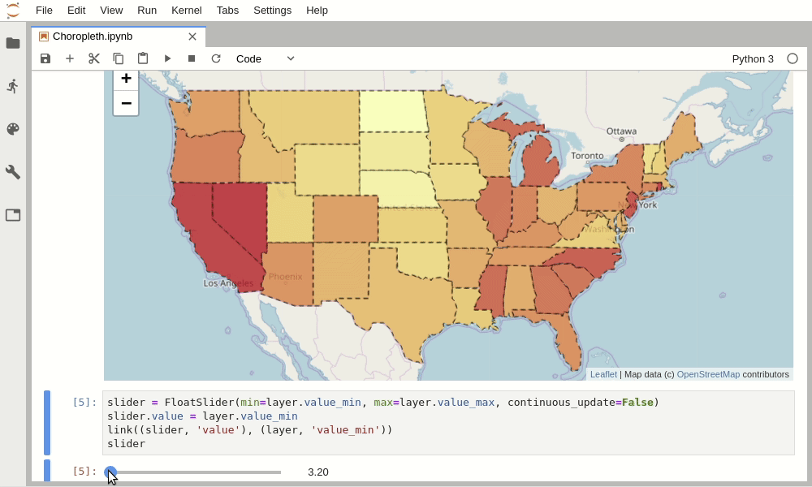

# ipyleaflet

[](https://ipyleaflet.readthedocs.io/en/latest/?badge=latest)
[](https://mybinder.org/v2/gh/jupyter-widgets/ipyleaflet/stable?filepath=examples)
[](https://gitter.im/jupyter-widgets/Lobby?utm_source=badge&utm_medium=badge&utm_campaign=pr-badge&utm_content=badge)

A Jupyter / Leaflet bridge enabling interactive maps in the Jupyter notebook.

## Usage

**Selecting a basemap for a leaflet map:**


**Loading a geojson map:**


**Making use of leafletjs primitives:**


**Using the splitmap control:**



**Displaying velocity data on the top of a map:**



**Choropleth layer:**



## Installation

Using conda:

```
$ conda install -c conda-forge ipyleaflet
```

Using pip:

```
$ pip install ipyleaflet
$ jupyter nbextension enable --py --sys-prefix ipyleaflet  # can be skipped for
notebook 5.3 and above
```

If you have JupyterLab, you will also need to install the JupyterLab extension:

```
$ jupyter labextension install jupyter-leaflet
```

Some users have found that the ``jupyterlab-manager`` is also required
in jupyterlab if the map does not display.

```
$ jupyter labextension install @jupyter-widgets/jupyterlab-manager
```

## Installation from sources

For a development installation (requires npm):

```
$ git clone https://github.com/jupyter-widgets/ipyleaflet.git
$ cd ipyleaflet
$ pip install -e .
$ jupyter nbextension install --py --symlink --sys-prefix ipyleaflet
$ jupyter nbextension enable --py --sys-prefix ipyleaflet
$ jupyter labextension install js  # If you are developing on JupyterLab
```

Note for developers:

- the ``-e`` pip option allows one to modify the Python code in-place. Restart the kernel in order to see the changes.
- the ``--symlink`` argument on Linux or OS X allows one to modify the JavaScript code in-place. This feature is not available with Windows.

    For automatically building the JavaScript code every time there is a change, run the following command from the ``ipyleaflet/js/`` directory:

    ```
    $ npm run watch
    ```

    If you are on JupyterLab you also need to run the following in a separate terminal:

    ```
    $ jupyter lab --watch
    ```

    Every time a JavaScript build has terminated you need to refresh the Notebook page in order to load the JavaScript code again.

## Documentation

To get started with using `ipyleaflet`, check out the full documentation

https://ipyleaflet.readthedocs.io/

## License

We use a shared copyright model that enables all contributors to maintain the
copyright on their contributions.

This software is licensed under the BSD-3-Clause license. See the [LICENSE](LICENSE) file for details.

## Related projects

The `ipyleaflet` repository includes the `jupyter-leaflet` npm package, which
is a front-end component, and the `ipyleaflet` python package which is the
backend for the Python Jupyter kernel.

Similarly, the [`xleaflet`](https://github.com/QuantStack/xleaflet/) project
provides a backend to `jupyter-leaflet` for the "xeus-cling" C++ Jupyter
kernel.


